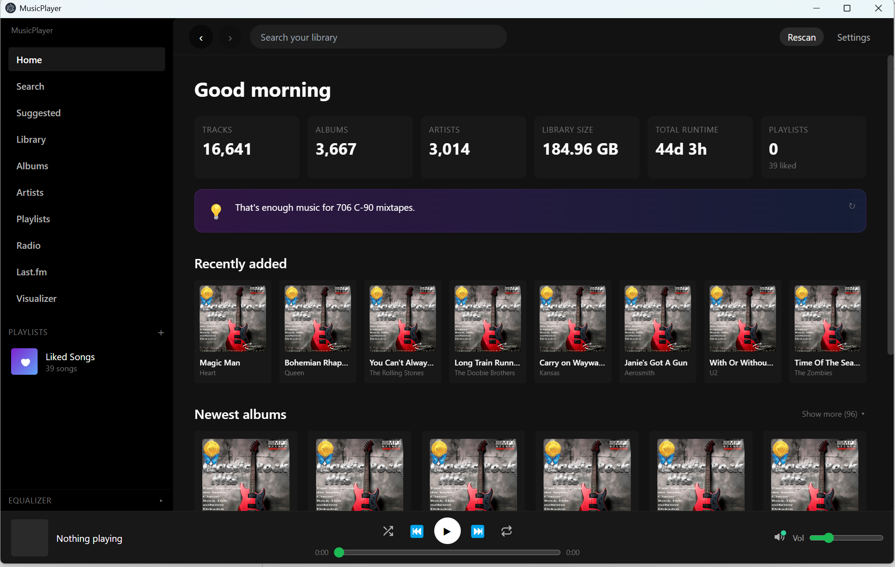

# MusicPlayer

A personal, local-first music player with a Spotify-style interface — Electron + React + TypeScript desktop app for Windows, macOS and Linux (including KDE Plasma).



## Easiest: download the installer

No Node.js, Git, or terminal needed — just download and run.

1. Go to **https://github.com/SixOfFive/musicplayer/releases/latest**
2. Grab the installer for your OS:
   - **Windows** — `MusicPlayer-Setup-X.Y.Z.exe`
   - **macOS** — `MusicPlayer-X.Y.Z.dmg` *(not code-signed yet — see note below)*
   - **Linux** — `MusicPlayer-X.Y.Z.AppImage`
3. **Windows:** double-click the `.exe`, pick an install folder, done. **macOS:** mount the `.dmg`, drag to Applications. **Linux:** `chmod +x MusicPlayer-*.AppImage` and run it.
4. Launch from your Start Menu / Launchpad / application menu.

The installer bundles everything: the app, Electron runtime, SQLite, FFmpeg for FLAC→MP3 conversion, butterchurn visualizer with 100 Milkdrop presets, all metadata providers. It's about **~170 MB** on disk after install.

**First launch Windows warnings (one-time):**
- **SmartScreen** ("Windows protected your PC") → **More info** → **Run anyway**. The installer isn't code-signed yet (costs ~$200/year for a cert).
- **Antivirus** may quarantine the bundled `ffmpeg.exe`. Whitelist that file if it does.

**macOS note:** without a Developer ID cert, Gatekeeper will block the DMG on first open. Control-click the `.app` → **Open** → **Open**. Only needed once.

### Updating a packaged install

**Automatic.** When a newer release is on GitHub, the installer version of the app detects it on startup and downloads the new installer in the background. You'll see a blue progress bar in the banner at the top; when it finishes it flips green ("Update ready — restart to install") and one click applies the update + relaunches. Your library, settings, and liked songs are preserved.

If auto-update can't reach GitHub (offline / firewall / corporate proxy), just download the new `.exe` from the Releases page and run it manually — it upgrades in place.

---

## Cutting a new release (maintainer notes)

Version tag and `package.json.version` must match exactly, or CI aborts with a clear error. To keep them in sync automatically, use:

```bash
npm run release:patch    # 0.1.0 → 0.1.1
npm run release:minor    # 0.1.0 → 0.2.0
npm run release:major    # 0.1.0 → 1.0.0
```

Each script runs `npm version <level>`, which:
1. Bumps `package.json` + `package-lock.json`
2. Creates a git commit `Release v0.X.Y`
3. Tags that commit `v0.X.Y`
4. Pushes the commit + tag

The tag push triggers the `build` workflow with `--publish always`, which creates a GitHub Release and uploads the Windows `.exe`, macOS `.dmg`, Linux `.deb`/`.tar.gz`, plus the `latest.yml` metadata files `electron-updater` reads. A few minutes later, every installed user gets the blue banner.

> **No RPM builds.** fpm's `rpmbuild` invocation on GitHub's hosted Ubuntu runners exits 1 intermittently and swallows rpmbuild's own stderr — not actionable. RPM-based distros (Fedora, openSUSE, RHEL) can extract the Linux `.tar.gz` and run the binary directly, or convert the `.deb` with [`alien`](https://wiki.debian.org/Alien).

---

## Installing on Windows from source — step by step

Use this path if you want the latest `main` branch, plan to hack on the code, or want in-app `git pull`-style updates. This walkthrough assumes no prior terminal experience.

### What you need before you start

- **Windows 10** (21H2+) or **Windows 11**. 64-bit only.
- An internet connection (for downloading Node.js and the app's dependencies).
- About **2 GB of free disk space** after dependencies are installed.
- A folder somewhere on your drive(s) that actually contains music files (`.mp3`, `.flac`, `.wav`, `.m4a`, etc.). Can be a network share / mapped drive — the app handles both.

### Step 1 — Install Node.js (LTS)

Node.js is the JavaScript runtime the app is built on. Electron itself is bundled inside the project's dependencies, but **Node.js needs to be installed system-wide** before you can install those dependencies.

1. Go to **https://nodejs.org**
2. On the home page you'll see two big green buttons. Click the one labeled **"LTS"** (Long-Term Support). It'll say something like *"Recommended For Most Users"*. As of writing, the LTS version is 22.x; anything **≥ 18** works.
3. Download the **Windows Installer (.msi)** — `node-vXX.XX.X-x64.msi` (the 64-bit version).
4. Double-click the downloaded installer.
5. Click **Next** through the wizard. You can keep every default — do NOT uncheck anything. In particular, leave these checked:
   - **Add to PATH**  *(critical — this lets our `run.bat` find `node` and `npm`)*
   - **Automatically install the necessary tools** *(optional — skip if you want; we don't need native compilers)*
6. Click **Install**. It takes a minute.
7. Click **Finish** when done.

**Verify Node is installed.** Press `Win+R`, type `cmd`, press Enter. In the black window that opens, type:

```
node -v
npm -v
```

Each should print a version number (e.g. `v22.11.0` and `10.9.0`). If you get *"'node' is not recognized…"*, close the cmd window, open a new one (the PATH change doesn't apply to already-open terminals), and try again. If it still fails, reboot and try once more.

### Step 2 — Install Git (recommended)

Git lets you clone the repository AND lets the app's built-in updater fetch new versions. **Strongly recommended** — without Git the updater can still check for updates but can't apply them automatically.

1. Go to **https://git-scm.com/download/win** — the 64-bit standalone installer downloads automatically.
2. Double-click the installer.
3. Accept defaults through every screen (there are many — just hit **Next** repeatedly). The important defaults are:
   - *"Git from the command line and also from 3rd-party software"* — yes.
   - *"Use bundled OpenSSH"* — yes.
   - *"Checkout as-is, commit Unix-style line endings"* — fine.
4. Click **Install** and wait.

Verify: new `cmd` window → `git --version` → should print a version.

### Step 3 — Get the code

You have two options:

**Option A — Clone with Git (recommended, lets the app self-update).** In a `cmd` window:

```
cd %USERPROFILE%\Documents
git clone https://github.com/SixOfFive/musicplayer.git
cd musicplayer
```

This puts the code in `Documents\musicplayer`.

**Option B — Download a zip (simpler, but no in-app updates).**

1. Open https://github.com/SixOfFive/musicplayer in a browser.
2. Click the green **Code** button → **Download ZIP**.
3. Move the downloaded zip somewhere permanent (e.g. `Documents\`).
4. Right-click the zip → **Extract All…** → pick a destination (e.g. `Documents\musicplayer`).

### Step 4 — Launch the app

Open the `musicplayer` folder in File Explorer. Find **`run.bat`** (it has a little gear icon).

**Double-click `run.bat`.**

What happens the first time:

1. A black terminal window appears.
2. It detects Node.js on your PATH. If not found, it tells you clearly and exits — go back to Step 1.
3. It runs `npm install`, which downloads ~500 MB of dependencies (Electron, React, butterchurn, ffmpeg-static, etc.). This takes **5–10 minutes** on a decent connection and is only this slow the *first* time. You'll see a lot of progress spinners and warnings — warnings are normal and harmless.
4. It re-links native modules (better-sqlite3) against Electron's Node ABI — another 30 seconds.
5. Verifies the bundled `ffmpeg.exe` is present (used for the "shrink album" FLAC→MP3 feature). If it got truncated during download, the script auto-runs `npm rebuild ffmpeg-static` to re-fetch it.
6. Finally, it launches both **Vite** (the dev server) and **Electron** (the actual window). The MusicPlayer window opens.

On subsequent launches, steps 3–5 are skipped unless something changed (the script compares `package.json` mtime against the last-install marker). Startup drops to ~10 seconds.

**If Windows SmartScreen warns you** about `run.bat` or `npm`, click **More info** → **Run anyway**. (The scripts are plain text; you can read them in Notepad before running.)

**If your antivirus quarantines `node_modules\ffmpeg-static\ffmpeg.exe`**, whitelist that path. It's the bundled FFmpeg binary from the official `ffmpeg-static` npm package — benign but some AV engines flag any unsigned ffmpeg build.

### Step 5 — First-run setup inside the app

When the MusicPlayer window first opens you'll see a welcome dialog asking for your music folder:

1. The path shown is the default picked by Windows (`C:\Users\<you>\Music`). If that's where your music lives, just click **Start scanning**.
2. Otherwise click **Choose folder…** and browse to where it actually is (a drive letter like `M:\` or a full path to a shared folder works fine).
3. Click **Start scanning**. The scan panel takes over the Home view showing progress. Small libraries (<1000 files) finish in seconds; large libraries (tens of thousands of FLACs) can take 5–15 minutes.
4. While the tag scan runs, a **background cover-art fetch** also runs in parallel. A purple strip at the bottom of the window shows its progress. Online art comes from MusicBrainz + Cover Art Archive + Deezer (no keys needed).
5. As albums fill in with covers, the Home, Albums, and Artists views update live — you don't need to reload.

### Step 6 — Day-to-day use

- To **launch** after the first install: just double-click `run.bat` again.
- To **update** the app: the yellow banner at the top announces new commits. Click **Update now** → it runs `git pull --ff-only` → click **Reload now**. If `package.json` changed, the next full `run.bat` restart auto-reinstalls dependencies.
- To **close**: close the window or press `Ctrl+C` in the terminal.

### Troubleshooting Windows

- **"node is not recognized"** → Node.js wasn't installed or PATH didn't update. Reinstall with *"Add to PATH"* checked, reboot.
- **run.bat closes instantly** → Open `cmd`, `cd` to the project folder, run `run.bat` from there so you can read any error.
- **"repository not found" during update** → you downloaded the zip instead of cloning. Reinstall via Option A above.
- **Blank window after launch** → open DevTools (**F12**) and check the console. Report the first red line.
- **ffmpeg missing after install** → `npm rebuild ffmpeg-static` in the project folder, or just re-run `run.bat`.

---

## Other platforms (brief)

**macOS / Linux:**

```bash
# one-time: install Node.js LTS via your preferred method
#   macOS:   brew install node
#   Debian:  sudo apt install nodejs npm
#   Fedora:  sudo dnf install nodejs npm
#   Arch:    sudo pacman -S nodejs npm

# then:
git clone https://github.com/SixOfFive/musicplayer.git
cd musicplayer
./run.sh
```

`run.sh` mirrors `run.bat` — checks Node + npm, warns about missing GTK/alsa/nss libs on Linux, installs deps, verifies the bundled ffmpeg, launches.

**Manual commands** (any platform):

```bash
npm install                 # installs deps + rebuilds better-sqlite3 for Electron ABI
npm run electron:dev        # Vite + Electron in parallel
npm run electron:build      # produces platform installer via electron-builder
```

## Features

### Library
- **Recursive scan** of one or more music folders with a 4Hz progress panel (phase, throughput, GB scanned, ETA, current file)
- **Tag reading** via `music-metadata` — ID3v1/v2.3/v2.4 (MP3, WAV), Vorbis Comments (FLAC, OGG, OPUS), APE, iTunes MP4 atoms (M4A/AAC), ASF (WMA)
- **Embedded cover art** extracted on scan, cached or written alongside audio (configurable)
- **Online cover art** fetched in the background after tag scan from: MusicBrainz → Cover Art Archive → Deezer — rate-limited per provider, cached, retries on manual rescan
- **Incremental scanning** — tracks unchanged by mtime+size are skipped; albums already marked "not found online" stay skipped unless touched
- **Startup resume** — if app was closed mid-art-fetch, resumes automatically on next launch
- **Live refresh** — Albums/Home/Library/Artist views re-fetch as covers land, without polling

### Playback
- **Single-click** any track row to play it (right-click for context menu: like / add to playlist / delete / etc.)
- Hover an album card → Spotify-style green ▶ play button
- Album detail page: big cover, title/artist/year/genre/runtime, big Play button, full track list, Shrink button if applicable, mini visualizer in the upper-right
- Artist detail page: every album of theirs + every track, Play All button
- **Shuffle** (one-time Fisher-Yates randomization, keeps current track at head) + **Repeat all** (🔁 with ∞ badge) + **Repeat one** (🔁 with 1 badge) in the Now Playing bar
- Scrubber with real seek support (HTTP Range requests through custom `mp-media` protocol via Electron's `net.fetch`)
- **10-band graphic equalizer** in a collapsible sidebar panel: ISO third-octave bands 31 Hz–16 kHz ±12 dB, preamp, 10 presets (Flat / Bass / Treble / Rock / Classical / Electronic / Vocal / Podcast / Loudness / Bass+Treble). Persists across sessions. Real Web Audio `BiquadFilterNode` chain.
- Volume persists across sessions
- Back/Forward buttons in TopBar track a proper history stack; scroll position restored per page so Back returns you to exactly where you left off

### Suggested tracks ("Suggested for you")
- Dedicated left-sidebar tab surfacing the **top 100 tracks** in your library ranked by how closely they match your listening taste. Pure local scoring — no ML, no external APIs, no data leaves your machine.
- Taste profile computed from `track_plays_summary` (play count + last-played timestamp) and `track_likes` (explicit positive signal), with a 180-day exponential recency half-life so this month's favourites dominate what you were into two years ago.
- Each candidate track gets a weighted score: **40% artist affinity + 25% genre affinity + 15% album affinity + 10% year proximity**, each component normalised 0-1 so one dominant artist can't swamp the signal. Year proximity uses a ±5-year bell curve around years you listen to heavily.
- **Discovery bias:** tracks played in the last 14 days are scaled down (stale for a "suggested" list), and liked-and-played-more-than-10-times tracks are halved so you're nudged toward genuinely new stuff from artists you already love.
- **Reason chip** on every row names the dominant signal — "More Eric Clapton", "Genre: Blues Rock", "From Layla and Other Assorted Love Songs", "1970s era" — so the list doesn't feel like a black box. Tinted by reason so the eye can quickly see the mix.
- Click any row to play; the full ranked 100 feeds into the queue so next/prev walk through your top picks. Refresh button recomputes on demand.

### OS-level media controls
- **Hardware media keys** (Play/Pause, Next, Prev, Stop on keyboards / Bluetooth headsets / remotes) work globally via Electron's `globalShortcut` — playback responds even when the MusicPlayer window isn't focused. If Spotify / iTunes is running and already owns the keys, a `[media-keys] could NOT bind` log line tells you why they're not responding.
- **`navigator.mediaSession`** integration wires track metadata (title, artist, album, cover art) + play/pause/next/prev/seek handlers into the OS:
  - **Windows** — System Media Transport Controls widget (the panel that pops up on media-key press + the Windows 11 quick-settings media tile)
  - **macOS** — Now Playing in Control Center + Touch Bar + the on-screen media-key overlay
  - **Linux** — MPRIS2 over D-Bus (KDE/GNOME media applets, `playerctl`, Bluetooth LE headset controls)
- Bluetooth headphone play/pause/next buttons route through the same pathway — cast a track to a Cast / HA / DLNA speaker, hit pause on your AirPods, and it pauses on whichever sink is actually playing.

### Audio output routing
- **Speaker icon next to the volume slider** opens an output-device picker with four grouped sections — local sinks, Google Cast / Nest, Home Assistant media_player entities, and DLNA / UPnP MediaRenderers — all in the same dropdown. Exactly one sink at a time; switching between them stops the previous cleanly.
- **Local devices**: System default + every named playback device (Bluetooth headphones, USB DACs, specific HDMI outputs) via `setSinkId` against `navigator.mediaDevices.enumerateDevices`. Selection persists across restarts and falls back to System default if the previously-chosen device has been unplugged.
- **Google Cast / Nest / Chromecast**: discovered via mDNS. Picking one pauses the local audio element and streams the current track to the receiver through a token-protected HTTP server on a random port. Play/pause, scrubber, and volume slider all proxy to the Cast device; the scrubber syncs with the device at 1 Hz. Uses `device.seekTo` (absolute) so clicks on the scrubber land where you click, not relative to the current position.
- **Home Assistant**: every `media_player.*` entity HA exposes — Sonos, AirPlay, Squeezebox, MusicAssistant, Snapcast, smart AVRs, HA Preview speakers — becomes a valid sink via one REST integration. Configured in Settings → Home Assistant with a long-lived access token. Token is stored only in `userData/settings.json`, never logged (error messages run through a token-scrubbing wrapper before surfacing), and shown as a masked placeholder with last-4 hint in the UI.
- **DLNA / UPnP MediaRenderer (bidirectional)**:
  - *Sender* — discovers renderers on the LAN via SSDP (VLC's built-in renderer, Kodi boxes, smart TVs, DLNA-capable hi-fi, HA's `media_player.dlna_dmr` entities). Picks via SOAP AVTransport: SetAVTransportURI + Play + Stop + Seek + SetVolume. 1 Hz GetPositionInfo poll drives the scrubber. Rescan on every picker-open so the scan indicator is visible when you're looking at the dropdown.
  - *Receiver* — this app advertises itself as a MediaRenderer, so VLC's "Render to…", BubbleUPnP, HA's `dlna_dmr` integration, etc. can cast TO us. We host the UPnP device description + SOAP action handlers + SSDP NOTIFY announcements. Incoming media URLs arrive via IPC and play through the shared `<audio>` element.
  - *Progress indication* — opening the picker triggers a 6-second scan window with a spinner + progress bar in the DLNA section header so you always see the scan firing.
- **CGNAT-aware LAN IP picking**: the shared media server advertises the first RFC1918 address (192.168 / 10 / 172.16-31), deprioritizing Tailscale's 100.64/10 range and link-local so speakers always receive a reachable URL even when Tailscale is running.
- **Soft-fail add-ons**: each remote sink (Cast, HA, DLNA sender, DLNA receiver) is registered behind a try/catch guard at app startup, so one integration failing (bad token, firewall blocking SSDP multicast, chromecast-api load error on a weird platform) can't take the whole app down. Failures log with a `[soft-fail]` prefix; the rest of the app keeps working.

### Playlists (universal .m3u8 format)
- **Left-sidebar "Playlists" tab** → dedicated grid view with Export-all / Import-from-folder buttons
- **Auto-export on every edit** — creating, renaming, adding/removing/reordering tracks, and liking/unliking all write a `.m3u8` immediately
- **Startup import** — any `.m3u8` in the export folder that isn't already in the DB gets loaded as a new playlist
- **Liked Songs** is a virtual playlist (backed by `track_likes` table) that also exports as `Liked Songs.m3u8`
- Playlist format: `#EXTM3U` + `#EXTINF:<sec>,<artist> - <title>` — readable by foobar2000, MusicBee, VLC, Winamp, Jellyfin, Plex, Navidrome, iTunes, and every Android music player
- Path style selectable: absolute (default) or relative (portable with the music tree)
- Default location: `<firstMusicFolder>/Playlists/` → falls back to `userData/Playlists`

### Track & album views
- **Right-click any track row** for a context menu: Play, Like, Add to playlist (any existing or + new), Remove from library, optionally Delete file (gated by a setting — uses `shell.trashItem`)
- **Sortable columns** on tracks and albums (title / artist / album / year / genre / duration / track # / date added)
- **Genre filter** on the Albums view
- **Artist search + sort** on the Artists view

### Statistics & fun facts
- **Every play is recorded**: per-track `play_count`, `last_played_at`, `total_listened_sec` + individual `play_events` for time-series
- Sessions with < 5 sec of audio are discarded as noise
- **Home screen** surfaces:
  - 6 stat tiles: tracks / albums / artists / library size / total runtime / playlists+likes
  - Purple "fun fact" card that auto-rotates every 12s (click to cycle manually) with 20+ facts generated from the library and play history:
    - Back-to-back playback time, top genre, year span, chunkiest album, longest track, cover-art coverage
    - Hours listened today / this week / this month / this year / last 30 days
    - Active day count, average per day, current + longest listening streaks
    - Most-musical hour of the day, biggest day of the week
    - Most-played track / artist / album / genre
    - Unique artists sampled, % of library played, longest continuous session, session count + average
    - Biggest single listening day, first track ever played
  - Recently-added strip + Your albums grid

### Internet radio (separate tab, no account)
- Left-sidebar **Radio** tab queries the community-maintained [Radio-Browser](https://www.radio-browser.info/) directory — ~40,000 live Icecast/Shoutcast/HLS streams worldwide, no key, no account
- Five modes: Top voted / Trending / Search / By genre (popular tags as chips) / By country (ISO-3166 codes)
- Click any station → immediate playback. NowPlayingBar swaps into radio mode: station name, country, codec, bitrate, LIVE badge, just a Play/Pause button
- Station favicons shown with graceful fallback to a 📻 glyph

### Last.fm (separate tab, requires free API key)
- Left-sidebar **Last.fm** tab — scrobble local plays to your Last.fm profile, browse your listening history and global charts
- Setup: register a personal Last.fm app at [last.fm/api/account/create](https://www.last.fm/api/account/create) (free), paste API key + shared secret into the app, authorize in your browser. Session key is long-lived.
- **Scrobbling** fires on every local file play: `track.updateNowPlaying` at start, `track.scrobble` on completion per Last.fm's rule (≥30 sec AND (≥4 min OR ≥50% of duration)). Runs alongside local stats, never replaces them.
- Tabs within: Top artists / Top tracks / Top albums (with time-period selector — 7 days through all-time) · Recently scrobbled (auto-refreshes every 30 s, shows "Now playing" badge) · Global charts (public, works even before connecting)
- Mini visualizer in the header. Scrobbling can be toggled on/off without disconnecting.

### Visualizer
- **Pluggable backend API** — every backend consumes an `AudioFrame` bus with FFT bins, waveform, bass/mid/treble energies, beat flag + intensity, running BPM
- **5 built-in visualizers** (Canvas2D, zero deps): Spectrum Bars, Mirror Bars, Oscilloscope, Radial Spectrum, Beat Particles
- **100 bundled Milkdrop presets** via `butterchurn` (WebGL port of Milkdrop 2) — real presets from `butterchurn-presets` enumerated at runtime
- **Mini visualizer** embedded in Playlist, Album, and Last.fm page headers — clickable to expand to full view
- **User plugins**: drop `.milk` files into any folder listed in Settings → Visualizer → Plugin folders
- **Winamp `.dll` plugins**: listed but marked unloadable. A Windows-only FFI bridge (`node-ffi-napi`) is scaffolded under the `native-winamp` backend kind — not implemented.

### FLAC → MP3 conversion ("Shrink albums")
- **Button on AlbumView** for any album with FLAC tracks, showing projected savings (e.g. "~427 MB · 58% of album") so you can decide before clicking
- **Yellow 🗜 badge on album cards** when converting FLAC→MP3 V0 would save at least 5% of the album's size (configurable 0–50% in Settings)
- Uses bundled **ffmpeg** (via `ffmpeg-static`) with `libmp3lame`
- Quality options: **VBR V0** (~245 kbps, archival — default), V2 (~190), CBR 320, CBR 256
- Preserves all tags (`-map_metadata 0`) and embedded cover art (`-map 0:v? -c:v copy`)
- **Safety**: refuses to overwrite existing MP3s, verifies every output is present and >= 30 KB, and only removes FLACs after *all* new MP3s verify. Originals go to the system trash by default (toggle-able)
- Progress bar, cancellation, and DB path/codec/size updates in a single transaction at the end

### Auto-update
- **Installer builds** (downloaded `.exe`/`.dmg`/`.deb`): `electron-updater` checks GitHub Releases on startup + every 30 min. When a new version lands, a blue banner shows live download progress, then flips green ("Restart to install") — one click applies. Library DB + settings + playlists all survive.
- **Source installs** (`git clone` + `run.bat`/`run.sh`): yellow banner when main has new commits. Click "Update now" → `git pull --ff-only`. `package.json` change triggers auto-`npm install` on next launch.

### Settings (five tabs)
- **Library** — folders, scan progress, database/cache paths, cover art storage (app cache *or* alongside audio files as `cover.jpg` / `folder.jpg`), playlist export folder + path style, destructive-ops gate
- **Scanning & Metadata** — incremental, fetch cover art, write-back tags, file extensions list, per-provider toggles + API keys + connection test
- **Visualizer** — target FPS, beat sensitivity, smoothing, fullscreen-on-play, plugin search folders, active plugin picker
- **Playback** — crossfade, ReplayGain mode
- **Shrink albums** — enable, MP3 quality, size-percentile threshold, trash vs. permanent delete

## Storage & standards

- **Music folder default** — `app.getPath('music')`:
  - macOS: `~/Music`
  - Linux (KDE/GNOME): XDG `XDG_MUSIC_DIR` (usually `~/Music`)
  - Windows: `%USERPROFILE%\Music`
- **Library DB & cover-art cache** — `app.getPath('userData')`:
  - macOS: `~/Library/Application Support/MusicPlayer/`
  - Linux: `~/.config/MusicPlayer/`
  - Windows: `%APPDATA%\MusicPlayer\`
- **Playlist export** — `<firstMusicFolder>/Playlists/` (configurable). Any `.m3u8` already there on startup imports as new playlists.
- **Cover art alongside audio** (optional) — `cover.jpg` (filename configurable) in each album folder. Compatible with Jellyfin/Plex/foobar/MusicBee/Navidrome conventions.

## Supported audio formats

Enabled by default:

| Ext | Container / codec | Tag format | Playback | Notes |
|---|---|---|---|---|
| `.mp3` | MPEG-1 Layer III | ID3v1, ID3v2 | ✅ | |
| `.flac` | FLAC | Vorbis Comments | ✅ | Lossless. Candidate for MP3 shrink. |
| `.wav` | RIFF/WAV (PCM) | ID3, LIST INFO | ✅ | |
| `.m4a` | MPEG-4 / AAC or ALAC | iTunes MP4 atoms | ✅ | |
| `.aac` | raw ADTS AAC | ID3v2 | ✅ | |
| `.ogg` | Ogg Vorbis | Vorbis Comments | ✅ | |
| `.opus` | Ogg Opus | Vorbis Comments | ✅ | |
| `.wma` | Windows Media Audio | ASF | ⚠ Windows only | Chromium's non-Windows builds ship without the WMA decoder. |

Also readable by the tag parser if you add them to the extensions list (scan-only — Electron can't play them without a native decoder): `.aiff` / `.aif`, `.mpc`, `.wv`, `.ape`, `.dsf` / `.dff`, `.mka`, `.webm`, `.tak`, `.tta`.

## Metadata & integrity providers

Configured in Settings → Scanning & Metadata. All free; some need a free API key.

| Provider | What it gives | Key | Wired |
|---|---|---|---|
| MusicBrainz | Canonical artist/album/track IDs (MBIDs), release metadata | No | Yes |
| Cover Art Archive | Front/back cover art keyed to MBIDs | No | Yes |
| Deezer | 1000×1000 album art via public search API | No | Yes |
| Last.fm | Bios, similar artists, scrobble counts | Free key | Stub |
| Discogs | Physical-media metadata, cover art | Free token | Stub |
| AcoustID / Chromaprint | Fingerprint → MusicBrainz match for tag-less files | Free key + `fpcalc` | Stub |
| AccurateRip | Per-track CRC32 of decoded audio samples for verified CD rips | No | Stub |
| CUETools DB (CTDB) | Alternative CRC/verification DB, wider coverage | No | Stub |

All providers go through per-provider `SerialRateLimiter` instances so the scan never bursts against anyone's API.

AccurateRip + CTDB exist specifically to answer *"is there a free online catalog with CRC checks for songs/albums?"* — yes, the same databases EAC, dBpoweramp, and XLD use. Verification panel is not yet wired into the UI.

## Project layout

```
electron/                   Main process
  main.ts                   Window, protocol, IPC registration, startup jobs
  preload.ts                contextBridge → window.mp
  services/
    db.ts                   better-sqlite3 schema + migrations
    settings-store.ts       JSON persistence + deep-merge
    cover-art.ts            Central save-album-art helper (cache or album folder)
    metadata-providers.ts   MB / CAA / Deezer with throttling
    ffmpeg.ts               Wraps ffmpeg-static for MP3 conversion
    playlist-export.ts      M3U8 write / parse / import orchestrator
    fs-fallback.ts          statWithFallback — SMB trailing-dot / case-drift recovery
    image-cache.ts          LRU thumbnail cache + on-disk persistence across restarts
    media-server.ts         Shared token-protected HTTP server used by Cast / HA /
                            DLNA sender; CGNAT-aware LAN IP picker lives here too
    cast.ts                 mDNS discovery + Cast transport (seekTo/pause/resume/
                            volume) + 1 Hz status poll
    homeassistant.ts        HA REST client: entity list, play_media, media_seek,
                            state poll. Token-scrubbing on every error message.
    dlna.ts                 SSDP discovery + SOAP controller (sender) AND a UPnP
                            MediaRenderer receiver (AVTransport + RenderingControl
                            + ConnectionManager service stubs, SSDP NOTIFY advertising)
  ipc/
    library.ts              tracks / albums / artists / stats / delete / artist detail
    scan.ts                 Recursive walk + tag parse + background art fetch
    metadata.ts             Provider list + test endpoints
    playlists.ts            Playlists + likes (auto-exports on every write)
    convert.ts              FLAC→MP3 per-album pipeline with progress events
    stats.ts                Play events + overview aggregations
    settings.ts             get/set
    visualizer.ts           Plugin discovery (built-in + bundled Milkdrop + user dirs)
    cast.ts                 Cast IPC bridge (list / play / pause / resume / stop /
                            setVolume / seek / onStatus)
    homeassistant.ts        HA IPC bridge (test / list / play / pause / resume /
                            stop / setVolume / seek / onStatus)
    dlna.ts                 DLNA IPC bridge (list / rescan / play / pause / resume /
                            stop / setVolume / seek / onStatus / onScanProgress /
                            onIncoming — the last two for discovery progress
                            indication and receiver-side push)
shared/
  types.ts                  Shared TS types + IPC channel names
src/
  audio/AudioEngine.ts      AnalyserNode + beat/BPM detection
  visualizer/
    plugin-api.ts           Backend contract + factory registry
    host.ts                 Canvas lifecycle + rAF loop
    backends/builtin.ts     Canvas2D built-ins
    backends/milkdrop.ts    butterchurn wrapper
  store/                    Zustand (player, library, convert, cast, homeassistant, dlna)
  hooks/                    useScanProgress, useLibraryRefresh
  lib/mediaUrl.ts           Build mp-media:// URLs
  components/               Sidebar, TopBar, NowPlayingBar, TrackRow, AlbumCard,
                            FirstRun, SortHeader, ScanProgressPanel, ArtStatusStrip,
                            LibraryStatsPanel, ShrinkAlbumButton, OutputDevicePicker
  views/                    Home, Library, Albums, Album (detail), Artists,
                            Artist (detail), Playlist, Playlists, Visualizer,
                            Settings/*
scripts/
  inspect-db.mjs            Diagnostic helper (run via electron-as-node)
  test-walk.mjs             Walk test harness
  test-parse.mjs            music-metadata smoke test
run.bat / run.sh            First-run installer + dev launcher
```

## Roadmap

- Wire Last.fm / Discogs / AcoustID provider HTTP bodies (interfaces exist; stubs in `metadata-providers.ts`)
- AccurateRip / CTDB verification panel on album detail view
- Drag-and-drop playlist reordering (IPC is ready)
- MPRIS D-Bus bridge for KDE Plasma media controls
- macOS MediaSession Now Playing widget
- Lyrics panel (plain `.lrc` file alongside audio)
- AVS preset backend (JS port exists)
- Optional Windows-only `node-ffi-napi` bridge for native Winamp `vis_*.dll` plugins
